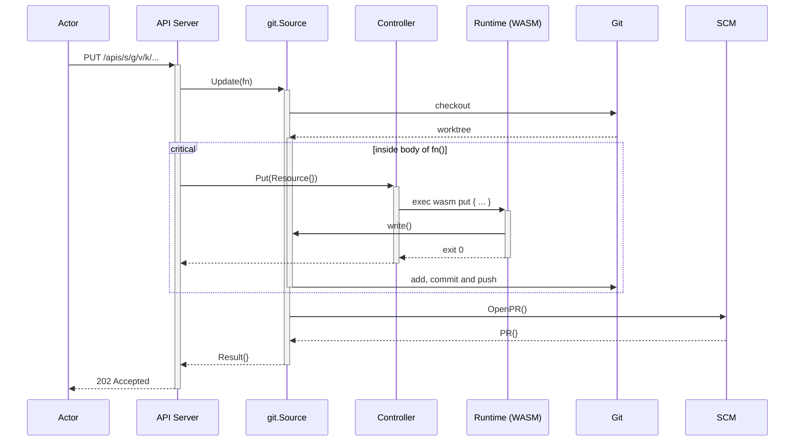

Design
------

This document outlines an initial MVP design for a `cup` alpha release.
It aims to outline some initial decisions around how `cup` structures it's internal interactions and external API.

## Intentions

We've taken a heavy dose of inspiration for the API from Kubernetes.
The object and resource model is a good potential fit for `cup`, so we want to replicate it as much as possible.
The self-describing API should lend itself well to building additional tooling (CLI, UI, etc.).

While we're taking a lot of inspiration from it, we don't intend to prescribe this tool to a Kubernetes only audience.
We feel it has scope and value beyond the Kubernetes ecosystem.

As such, there will be a bit of wheel re-invention at the start of this project.
We don't want folks to have to have a Kubernetes cluster, or for `cup` to have a hard dependency on all the Kubernetes internals.
We will definitely pick and pluck in dependencies as and where they make sense (to speed things up or ensure consistency where it makes sense).

## Goals

Enable folks to put declarative APIs onto their Git repositories in order to gradually build automation and internal tooling in and around their configuration repositories.

## Non-Goals

This is **not** an attempt to build a compatible Kubernetes API server backed by Git.
We purely see there being value in the approach taken by Kubernetes to represent resources internally and via the API.

## Overview

The goal is to provide users with a way to manage the logical resources represented in Git repositories.
`cup` takes care of extracting resources and translating your desired changes into commits, branches and pull-requests.

```
┌─────┐            ┌──────────────────────────────┐         ┌──────────────────────────────────┐
│     │            │ Controller                   │         │ GitHub                           │
│     │            │                              │         │                                  │
│     │            │  flipt.io/Flag/v1            │         │  ┌─────────────────────┐         │
│     ├────────────▶                              │         │  │ Git Repository      │         │
│     │            │ ┌──────────────────────────┐ │         │  │                     │         │
│     │            │ │ Wazero                   │ │  ┌──────┼─▶│                     │         │
│     │            │ │                          │ │  │      │  │                     │         │
│     │            │ │ exec get <kind> ...      │ │  │      │  └─────────────────────┘         │
│     │            │ │ exec list <kind> ...     │ │  │      │  ┌─────────────────────┐         │
│     │            │ │ exec put <kind> ...      │ │  │      │  │ Git Repository      │         │
│     │            │ │ exec delete <kind> ...   │ │  │      │  │                     │         │
│     │            │ │                          │ │  │      │  │                     │         │
│     │            │ └───────▲─────────┬────────┘ │  │      │  │                     │         │
│  A  ◀────────────┤         │         │          │  │      │  │                     │         │
│  P  │            │ ┌───────┴─────────▼────────┐ │  │      │  └─────────────────────┘         │
│  I  │            │ │ Source                   ◀─┼──┘  ┌───▶                                  │
│     │            │ │                          │ │     │   │                                  │
│  S  │            │ └──────────────────────────┘ ├─────┘   └──────────────────────────────────┘
│  e  │            └──────────────────────────────┘         ┌──────────────────────────────────┐
│  r  │                                                     │ GitLab                           │
│  v  │                                                     │                                  │
│  e  │            ┌──────────────────────────────┐         │  ┌─────────────────────┐         │
│  r  │            │ Controller                   │         │  │ Git Repository      │         │
│     ├────────────▶                              │         │  │                     │         │
│     │            │  apps/Deployment/v1          │         │  │                     │         │
│     ◀────────────┤                              │         │  │                     │         │
│     │            │ ...                          │         │  │                     │         │
│     │            └──────────────────────────────┘         │  └─────────────────────┘         │
│     │            ┌──────────────────────────────┐         │  ┌─────────────────────┐         │
│     │            │ Controller                   │         │  │ Git Repository      │         │
│     ├────────────▶                              │         │  │                     │         │
│     │            │  my.org/Server/v1alpha1      │         │  │                     │         │
│     ◀────────────┤                              │         │  │                     │         │
│     │            │ ...                          │         │  │                     │         │
│     │            └──────────────────────────────┘         │  └─────────────────────┘         │
│     │                                                     │                                  │
│     │              ...                                    │                                  │
└─────┘                                                     └──────────────────────────────────┘
```

## Resources

Resources are the extension point of `cup`.
They are the interface chosen by `cup` operators and configurers to expose over a chosen Git repository.
A resource can be whatever you want to store or represent in your Git repository.

For example:
- Service configuration (e.g. source artefacts, log levels, resource quotas and so on)
- Feature flag state
- CI/CD Pipelines

Resources are derived directly from Kubernetes Resources.

A Resource is typed using the three following fields:

- Group (a collection of related kinds)
- Version
- Kind (a single type name)

Each unique instance of a resource is identified by a `namespace` and `name`.

A resource can also have additional metadata in the form of annotations and labels.
Labels is a map of key/value string pairs, which is then indexed and facetable when listing resource types via the API.
Annotations is a map of arbitrary key/value string pairs which is not indexed, but intended for external tooling to leverage for their purposes.

Each resource contains a specification field, which is unique per resource type.
The contents of this field is controlled via a schema defined on the Resource Definition

**Example Resource Payload**

```json
{
  "apiVersion": "flip.io/v1alpha1",
  "kind": "Flag",
  "metadata": {
    "namespace": "production",
    "name": "new-project-cup",
    "labels": {
      "project-type": "moonshots"
    },
    "annotations": {}
  }
  "spec": {}
}
```

### Resource Definition

A resource definition is similarly structured to that of a Resource itself.
It is inspired by, but differs in slight ways to that of Kubernetes Custom Resource Definitions.
It's purpose is to identify a type and associated schema for validating the specification section of an individual resource.
The schema provided is defined using JSONSchema syntax and pertains to what can go in the `spec` field of a particular resource.

Schemas can be defined per version of the group and kind.

**Example Resource Definition Payload**

```json
{
  "apiVersion": "cup.flipt.io/v1alpha1",
  "kind": "ResourceDefinition",
  "metadata": {
    "name": "flags.flipt.io",
  }
  "names": {
    "kind": "Flag",
    "singular": "flag",
    "plural": "flags",
  },
  "spec": {
    "group": "flipt.io",
    "versions": {
      "v1": {
        "schema": {
          "type": "object"
          "properties": {
            "enabled": {"type": "boolean"}
            "description": {"type": "string"}
          }
        }
      }
    }
  }
}
```

## API Server

`cup` is fronted with an API that can be used to discover which resource types are available, as well as read and write resource instances themselves.

The API will initially have two make categories of functionality:

1. Resource type cataloging
2. Resource type instance management

### Resource Type Catalog

This section of the API is focussed on supporting callers discovering which types are registered for consumption.

The `/apis` endpoint will list all loaded and available resource definitions.

### Resource Type Instance APIs

This section of the API is manifested based on the registered resource types for the configured Git repositories.

The root prefix for all of these APIs will be `/apis`.

Each resource types will have its own relevant prefix of the API surface area, which will support:

- Getting individual resources
- Listing (and filtering) sets of the given resource type
- Putting the state of individual resources
- Deleting individual resources

Each API section will be prefixed in the form: `/apis/<group>/<version>/namespaces/<namespace>/<plural>`.

The following is an explanation of each of the path parameters:
- `group` refers to the resource type group
- `version` refers to the resouece type version
- `plural` refers to the resource type `names.plural` value
- `namespace` refers to the instance namespace

When a request is made for a particular type, the API Server parses, validates and then delegates the request onto a relevant `Controller`.

### Authentication and Authorization

This section is TBD.

Given we're taking inspiration from the Kubernetes resource and API structure we've co-opted, the intent is we can leverage the resource metadata (types, namespaces, names) and operation verbage (get, list, put and delete) in some kind of future authorization policy language.
Likelihood is we explore something close to the RBAC mechanisms available in the Kubernetes ecosystem.

## Controller

Controllers sit at the heart of `cup`. A single controller handles processing requests for a single resource type via it's associated controller.

A controller manages the interface between the API resources and the target filesystem (local or git).

Out of the box there are two implementations of a controller:
- WASM
- Template

The `template` implementation is simple and rigid controller which uses Go templates to make decisions on where API resources are stored in the target.
It simply puts the resources in their JSON form directly on the target and expects to read them in this form from the source.

The `wasm` implementation is an extension point for a variety of custom controllers to be implemented.
Below is a walkthrough the WASM/WASI interface required to be implemented by a WASM controller instance.
This is likely to evolve and change heavily over time.

## WASM/WASI Process Interface

The WASM binary implementations expose a command-line interfaces with a number of subcommands.

The controller will take care of adapting each request into an appropriate set of command line arguments and/or STDIN written payloads.
It then interprets any exit codes and output written to the standard output streams (STDOUT / STDERR).

It is also the controllers job to prepare the WASM runtime environment for a given request.
A request can identify a desired target revision. Otherwise, a default reference is chosen from configuration.
The controller will retrieve a read-only snapshot of the entire Git tree for the resolved revision.
This will be mounted as the root filesystem for the WASM runtime.

Given a mutating operation is requested (`put` or `delete`), the controller will support writes on the filesystem.
The controller will intercept these writes and compose them into a pull request containing the changes made.

A single binary is responsible for handling the core controller operations across a group of one or more kinds.

### get

Retrieving an instance of a resource by `namespace` and `name`.

```
exec wasm ["get", "<kind>", "<namespace>", "<name>"]           
        ┌──────────────────────┐                               
        │                      │        {                      
        │     WASM Binary      │            "apiVersion": "..."
        │                      │            "kind": "...",     
        │                      │            ...                
        │                      ├──────▶ }                      
        └──────────────────────┘                               
```

The purpose of this subcommand is to address an instance by namespace and name.
It should handle the sub-command `get`.
Then the following two arguments will the `namespace`, followed by the `name` of the instance.

The resource should be extracted from the local-filesystem.
The filesystem will contain the configured target Git repositories HEAD tree for the resolved reference mounted at `/`.

#### Output

| Meaning   | Exit code | STDOUT                |
| --------- | --------- | --------------------- |
| success   | 0         | JSON encoded resource |
| error     | 1         | JSON encoded message  |
| not found | 2         | JSON encoded message  |

### list

Listing and filtering a set of resource instances by `namespace` and optional `labels`

```
exec wasm ["list", "<kind>", "<namespace>", ...(k/v pairs)]        
        ┌──────────────────────┐                                   
        │                      │        [{                         
        │     WASM Binary      │            "apiVersion": "..."    
        │                      │            "kind": "...",         
        │                      │            ...                    
        │                      ├──────▶ }, ...]                    
        └──────────────────────┘                                  
```

The purpose of this subcommand is to return a list of instances found by the target controller.
The controller should handle filtering by namespace and optionall by a list of `key=value` pairs of labels.

#### Output

| Meaning   | Exit code | STDOUT                       |
| --------- | --------- | ---------------------------- |
| success   | 0         | JSON encoded resource stream |
| error     | 1         | JSON encoded message         |
| not found | 2         | JSON encoded message         |

### put

Creating or updating an existing resource.

```
exec wasm ["put", "<kind>"]                                          
                              ┌──────────────────────┐               
{                             │                      │               
    "apiVersion": "..."       │     WASM Binary      │               
    "kind": "...",            │                      │               
    ...                       │                      │               
}                       ──────▶                      ├──────▶ { TBD }
                              └──────────────────────┘               
```

The purpose of this subcommand is to create a new or update (upsert) an existing resource.
Implementations should adjust the filesystem appropriately for the resource type and controllers needs.
The new resource payload is serialized on STDIN.

TBD:

- What makes sense to return from the binary?

#### Output

| Meaning   | Exit code | STDOUT               |
| --------- | --------- | -------------------- |
| success   | 0         | TBD                  |
| error     | 1         | JSON encoded message |

#### Flow

This diagram gives an overview of the flow of a successsful `PUT` request:



### delete

Removing an existing resource.

```
exec wasm ["delete", "<kind>", "<namespace>", "<name>"]        
        ┌──────────────────────┐                               
        │                      │                               
        │     WASM Binary      │                               
        │                      │                               
        │                      │                               
        │                      ├──────▶ { TBD }                
        └──────────────────────┘                               
```

The purpose of this subcommand is to remove an existing resource.
Implementations should adjust the filesystem appropriately for the resource type and controllers needs.
The namespace and name of the resource is passed as arguments to the subcommand.

TBD:

- What makes sense to return from the binary?

## SCM and Git providers

Proposed implementations:

- GitHub
- GitLab
- Gitea
