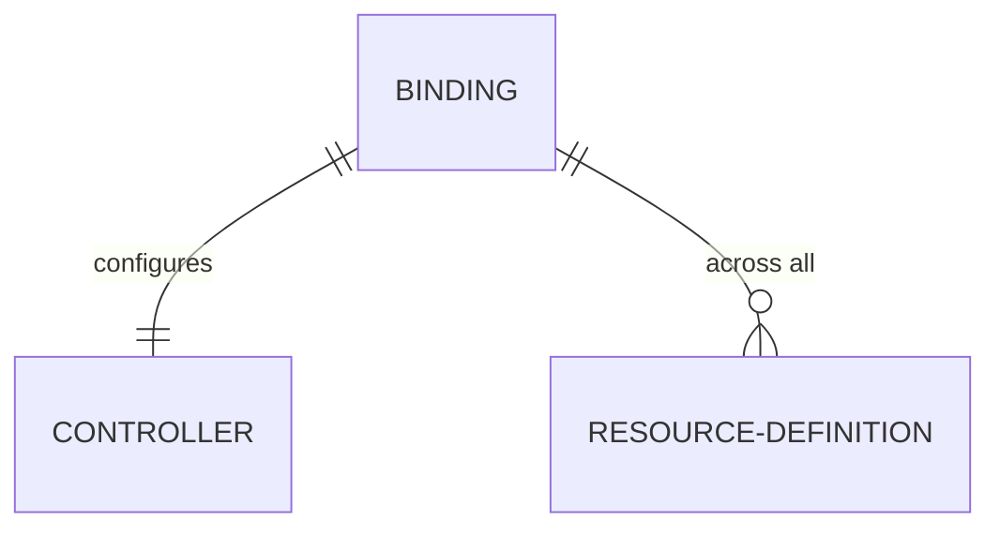

import { Callout } from 'nextra/components';

Bindings
--------

<Callout emoji="⚙️">
Head to the configuration reference section for [Bindings](/configuration/bindings)
to learn how they can be configured.
</Callout>

Bindings are the glue that combines definitions and controllers together and exposes them through the Cup API.
This is the last and simplest piece of the equation when configuring a Cup instance.
A binding declares which resource definitions should be exposed and the controller that will handle their operations.

It is as simple as that.
Without them Cup wont expose anything, so do remember to set up your bindings!

