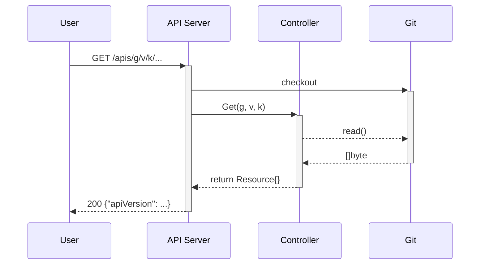
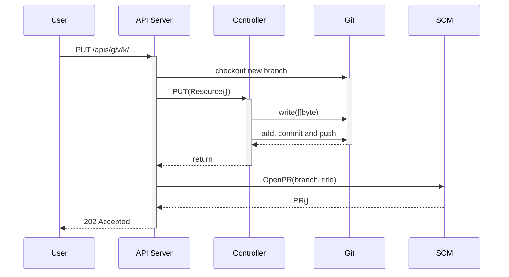

import { Callout } from 'nextra/components';

Controllers
-----------

<Callout emoji="⚙️">
Head to the configuration reference section for [Controllers](/configuration/controllers)
to learn how they can be configured.
</Callout>

Controllers declare _how_ to handle storing, retrieving and removing resource kinds from a repository.

Requests to Cup for a particular resource (get, list, put or delete) ultimately end up being handled by a **controller**.
By default, Flipt ships with a basic controller known as the `template` controller and an extensible controller called the `wasm` controller.

<Callout type="info" emoji="ℹ️">
You will learn in the next section on [bindings](/concepts/bindings) how to configure which controllers handle which resource definitions.
</Callout>

Controllers are the most important extension point in Flipt.
They allow operators to create custom transformation logic between API resources and their resulting representation in the repository.
Meaning there is no strict requirement that these two concepts need to have a 1:1 mapping (though the `template` controller does support this kind of logic out of the box).

## Lifecycle of a Cup Resource Request

Cup automatically exposes four verbs for each configured resource:

- Get
- List
- Put
- Delete

The first two are read-only operations and the second two produce written changes to state.
Reads simply source the current state from Git for a particular revision through the means of a controller to handle parsing source and serializing responses.
Writes also go through to Git via the means of a controller, however, they also result in changes being presented as a pull request.

The following two sections attempts to explain these processes in a little more depth.

### Read Requests



The API server is the first stop for all operations on resources in Cup.
It takes care of collecting up the relevant state from Git and delegating onto the relevant **controller**.
Controllers have no concept of Git, they work purely over a filesystem abstraction.
It is up to the API layer to build the expected implementation of the filesystem for a particular revision.
This filesystems root will be the root directory of the target Git repository being sourced from. 

### Write Requests



Write requests on the other hand are a little more complicated.
In this scenario, the filesystem abstraction passed to a Controller can handle writes.
The API server which builds the implementation of the filesystem, will do so over a worktree on a new branch.
Ultimately, the server will add, commit and push changes made by the controller to the configured upstream.
Once the branch is pushed, it will also open a pull request and return to the caller a URL for where to find it.

For `PUT` operations the controller has to reconcile the current filesystem state with a new desired state for the requested resource.
This involves locating the relevant file(s) for the requested resource and updating them to match the current desired state.

For `DELETE` operations the controller needs to locate and remove any state from the filesystem relevant to the requested resource.

Controllers need to be developed to ensure these operations are idempotent.
For a filesystem in one particular state and a request for a resource to be either set (put) to some or removed (delete) the result should be some new filesystem state. This result should always be the same, for the same combination of initial filesystem state and requested operation.

## Built-in Controllers

Cup comes with a couple baked in controllers. One controller (`template`) is configuration driven and the other (`wasm`) is broadly extensible through your own code.

### Template Controller

This controller is simple, but effective. It only requires a little configuration to set it up and get going.

All this controller does is handle API resource payloads as-is.
Meaning, for a PUT operation it simply writes the entire API payload to a particular file in the target filesystem.
For GET operations it expects the API resource to be written and encoded accordingly to a particular file path location.
And finally, for DELETE, it simply removes the file at an expected file path location.

In order to decide which file path is relevant for a particular resource, the `template` controller uses Go's template language to build a relevant path.
This is where the controller gets it's name.

```go
const (
	defaultListTmpl     = `{{ .Namespace }}/{{ .Group }}-{{ .Version }}-{{ .Kind }}-*.json`
	defaultResourceTmpl = `{{ .Namespace }}/{{ .Group }}-{{ .Version }}-{{ .Kind }}-{{ .Name }}.json`
)
```

Above are the default definitions for the two configurable templates used by the controller to both locate a single instance, or list many.
The listing template produces a glob syntax path. This glob path will be used on `list` operations to locate all the files containing definitions for resources of a particular kind in a particular namespace.
The resource template identifies a single path for a single named resource.

Both of these templates can be overriden via Cups controller configuration.
Head to [Configuration: Controller: Template](/configuration/controllers#template) to learn how.

### WASM Controller

The WASM controller leverages the [Wazero](https://wazero.io/) runtime for Go to support implementing Controllers in the language of your choice.
WASM binary implementations should expose a command-line interfaces with a number of subcommands.

<Callout emoji="💡">
Checkout the [Flipt Controller](https://github.com/flipt-io/cup/blob/53f1aa7cfb90c3a11aecf62eb8d1b726623a37cd/ext/controllers/flipt.io/v1alpha1/cmd/flipt/main.go#L27-L32) we have implemented in Go. This is compiled to WASM so that we can managed features flags as configuration via Cup.
</Callout>

The controller will take care of adapting each request into an appropriate set of command line arguments and/or STDIN written payloads.
It then interprets any exit codes and output written to the standard output streams (STDOUT / STDERR).

It is also the controllers job to prepare the WASM runtime environment for a given request.
A request can identify a desired target revision.
Otherwise, a default reference is chosen from configuration.
The controller will receive a filesystem implementation of the entire Git tree for the resolved revision.
This will be mounted as the root filesystem for the WASM runtime.

Given a mutating operation is requested (`put` or `delete`), the controller will support writes on the filesystem.

A single binary is responsible for handling the core controller operations across a group of one or more kinds.

#### get

Retrieving an instance of a resource by `namespace` and `name`.

```
exec wasm ["get", "<kind>", "<namespace>", "<name>"]           
        ┌──────────────────────┐                               
        │                      │        {                      
        │     WASM Binary      │            "apiVersion": "..."
        │                      │            "kind": "...",     
        │                      │            ...                
        │                      ├──────▶ }                      
        └──────────────────────┘                               
```

The purpose of this subcommand is to address an instance by namespace and name.
It should handle the sub-command `get`.
Then the following two arguments will the `namespace`, followed by the `name` of the instance.

The resource should be extracted from the local-filesystem.
The filesystem will contain the configured target Git repositories HEAD tree for the resolved reference mounted at `/`.

##### Output

| Meaning   | Exit code | STDOUT                |
| --------- | --------- | --------------------- |
| success   | 0         | JSON encoded resource |
| error     | 1         | JSON encoded message  |
| not found | 2         | JSON encoded message  |

#### list

Listing and filtering a set of resource instances by `namespace` and optional `labels`

```
exec wasm ["list", "<kind>", "<namespace>", ...(k/v pairs)]        
        ┌──────────────────────┐                                   
        │                      │        [{                         
        │     WASM Binary      │            "apiVersion": "..."    
        │                      │            "kind": "...",         
        │                      │            ...                    
        │                      ├──────▶ }, ...]                    
        └──────────────────────┘                                  
```

The purpose of this subcommand is to return a list of instances found by the target controller.
The controller should handle filtering by namespace and optionall by a list of `key=value` pairs of labels.

##### Output

| Meaning   | Exit code | STDOUT                       |
| --------- | --------- | ---------------------------- |
| success   | 0         | JSON encoded resource stream |
| error     | 1         | JSON encoded message         |
| not found | 2         | JSON encoded message         |

#### put

Creating or updating an existing resource.

```
exec wasm ["put", "<kind>"]                                          
                              ┌──────────────────────┐               
{                             │                      │               
    "apiVersion": "..."       │     WASM Binary      │               
    "kind": "...",            │                      │               
    ...                       │                      │               
}                       ──────▶                      ├──────▶ { TBD }
                              └──────────────────────┘               
```

The purpose of this subcommand is to create a new or update (upsert) an existing resource.
Implementations should adjust the filesystem appropriately for the resource type and controllers needs.
The new resource payload is serialized on STDIN.

TBD:

- What makes sense to return from the binary?

##### Output

| Meaning   | Exit code | STDOUT               |
| --------- | --------- | -------------------- |
| success   | 0         | TBD                  |
| error     | 1         | JSON encoded message |

#### delete

Removing an existing resource.

```
exec wasm ["delete", "<kind>", "<namespace>", "<name>"]        
        ┌──────────────────────┐                               
        │                      │                               
        │     WASM Binary      │                               
        │                      │                               
        │                      │                               
        │                      ├──────▶ { TBD }                
        └──────────────────────┘                               
```

The purpose of this subcommand is to remove an existing resource.
Implementations should adjust the filesystem appropriately for the resource type and controllers needs.
The namespace and name of the resource is passed as arguments to the subcommand.

TBD:

- What makes sense to return from the binary?
